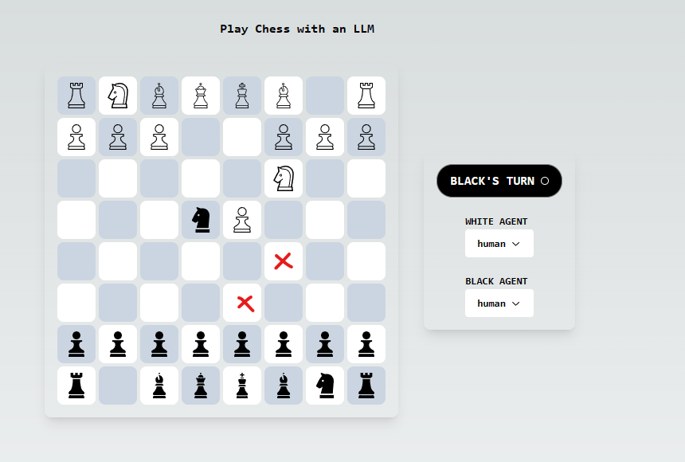

# play-chess-with-llm

A fullstack web application to play chess with a chess engine powered by an LLM.
Currently GPT-3.5 and GPT-4 are supported but this can be expanded to use other models or a mixture of models for different parts of the engine.

The chess engine is a compressed and budgeted form of minimax. The LMM generates 
the moves likely to be played by an expert player and evaluates game states.

The minimax runs in parallel on the server so can scale up to a deeper tree search
with a logarithm increase in latency (compared to number of nodes explored).

This is a [Next.js](https://nextjs.org/) project bootstrapped with [`create-next-app`](https://github.com/vercel/next.js/tree/canary/packages/create-next-app).

## Installation & Setup

First install the dependencies:

```npm install```

or

```yarn install```

Then create a `.env` file in the root directory with the following content:

```
  OPENAI_API_KEY=your-openai-api-key
  OPENAI_ORGANIZATION_ID

```

## Getting Started

First, run the development server:

```bash
npm run dev
# or
yarn dev
# or
pnpm dev
# or
bun dev
```

Open [http://localhost:3000](http://localhost:3000) with your browser to see the result.

See `/llm.log` for raw logs of the LLM API calls.

See `/minimax.log` for raw logs of the minimax algorithm's progress.

## Algorithm

### Description

The algorithm is a compressed and budgeted form of minimax.

The LLM has two tasks,

1. Generate the moves likely to be played by an expert player. (Successor task)

2. Evaluate game states. (Evaluation task)

The LLM executes these with the help of a third task, describing/analyzing the game state. In this the LLM produces an unstructured description of the game state. This description is cached and inputted as context to instructions for the above two tasks.

Since the description task is separated and cached it is only done once per game state.

The information given to the LLM to generate this description is:

- The board state drawn out in asccii characters. 
Example:
```
  a b c d e f g h
8 r . b q k b n r 8
7 p p . n p p p p 7
6 . . p . . . . . 6
5 . . . p . . . . 5
4 . . . P . B . . 4
3 . . . . . . P . 3
2 P P P . P P . P 2
1 R N . Q K B N R 1
  a b c d e f g h
```

- The count of each type of piece on the board as a json object.

- A list of each piece's position on the board

- The move history in algebraic notation separated by spaces.

- Who's turn it is to play

This information is fed back into the LLM along with the generated description for the successor and evaluation tasks.

### Example

For the following example, GPT-4 was playing black with a max depth of 1.



The LLM specified the two cells marked in red as the most likely moves to be played next by an expert player.

The algorithm then explored the two game states and since the depth was 1, it evaluated those games states without exploring further.

The LLM produced a lower score for D6 which indicates it is a worse state for the white player. The algorithm then chose D6 as the move to play.

Note that each game state is evaluated on it's own without considering the other game states. This allows the result to be cached for future use.

If the depth had been higher than 1 and the algorithm had budget to do so, it would have explored the game states resulting from the white player's most likely moves and so on.

### Notes

The minimax runs in parallel on the server so can scale up to a deeper tree search
and use a logarithm increase in latency (compared to number of nodes explored) and
a linear increase in LLM API usage.

The algorithm caches nodes explored and nodes currently being explored to avoid
redundant computations. It also caches the successors (moves the LLM said were likely to be played next) found or currently being computed for each explored game state. This caching should reduce the scaling cost of the tree search to a slightly sub-linear resource usage in the number of nodes explored (provided the cache doesn't fill up).

The budgeting system allows for a dynamic effort to be applied to any of the LLM tasks and the depth to react accordingly. For example, it may be helpful to use a cheaper LLM to evaluate low budget game states and a more expensive LLM to generate successors for high budget game states.

### Tuning options

The degree of compression can be tuned by changing the target successor count in `/src/ChessLogic/agents/LlmMinimax.ts` Higher compression (lower target successor count) will decrease the number of child nodes for each game state. This can either decrease LLM API usage or increase the depth of the tree search for the same budget.

The budget can be tuned in `/src/ChessLogic/agents/callGenericAgent.ts` and will affect the depth of the tree search. The depth can also be directly set in this same file. A max depth will override budget decisions. Tuning depth via budget allows the algorithm to look deeper into more promising game states and game states with fewer successors. There's a number of reasons the LLM might produce fewer successors for a game state however usually it's because a game state with fewer successors has more clear cut decisions for the next move, i.e. protecting a piece or capturing a piece.

Prompts within `/src/ChessLogic/agents/LlmMinimax.ts` can be tuned to produce more or less verbose descriptions of the game state. This can affect the quality, cost, and latency of the LLM's responses.

### Observations

- Generally plays "good" moves but constantly blunders

- gpt-4 can definitely beat random play consistently

- The game state evaluation tends to work quite well; most issues are with the successor generation

- gpt-4 is much better than gpt-3.5 at generating successors and correct game descriptions

- plays quite defensively (sometimes gets stuck in a loop of moving the same piece back and forth)

### Drawbacks 

- It's super slow

Generating the descriptions is the issue here. There's a lot of tokes in the descriptions and LLM's time complexity is roughly linear in the number of tokens. If this were a really big system, a global cache could help here.

- It's super expensive

Same concern as above but input tokens are also a cost factor. 

- Successors sometimes doesn't return enough moves and excludes good moves

This is more serious with GPT-3.5 than GPT-4. The issue is the LLM outputs decidedly too few valid moves to consider for a given game state. It's prompted to give "around 8" but sometimes only returns 1 or two valid moves.

- It has trouble with complicated moves

Specifically it seems to have more trouble identifying the movement patterns and therefore planning ahead for these pieces. Ideally a deeper search would help here to take the planning burden off the LLM. The issue is deeper search is just too slow.